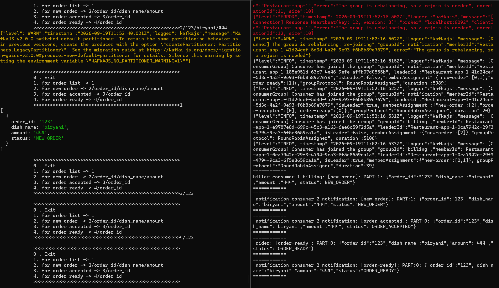
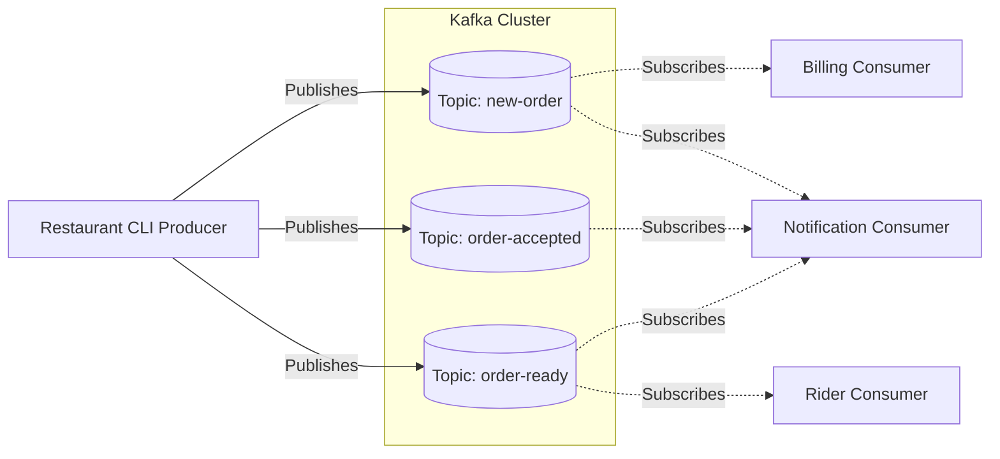

**🔗 Source Code:** [View on GitHub](https://github.com/OriginalAnkit/learning/tree/master/restaurant-kafka-cli)



Have you ever wondered how food delivery apps handle thousands of orders, notifications, and billing processes simultaneously? The secret lies in **Event-Driven Architecture (EDA)**. 

In this article, I'll walk you through a simple yet powerful CLI application that simulates a restaurant's order management system using **Node.js** and **Apache Kafka**.

## Why Kafka for a Restaurant System?

When a customer places an order, multiple things need to happen:
1. The **Billing** service needs to process the payment.
2. The **Notification** service needs to send updates to the user.
3. The **Rider** service needs to assign a delivery partner once the food is ready.

Instead of having a monolithic app where each component calls the other synchronously (which can lead to bottlenecks), we can use Kafka. The central system simply announces, *"Hey, a new order was placed!"* or *"The order is ready!"* The respective services listen for these events and act independently. 

## The Architecture Diagram

Here is a visual representation of how our services interact with Kafka topics:



As shown above:
- The **Billing** service only cares about the `new-order` events.
- The **Rider** service only springs into action when an `order-ready` event occurs.
- The **Notification** service is the nosy one—it tracks the order at every step (`new-order`, `order-accepted`, and `order-ready`) to keep the customer updated!

## Code Explanation

Let's dive into the core of how this is implemented using `kafkajs`.

### 1. Kafka Initialization and Admin Client
Before producing or consuming, we ensure our required topics exist. The `init()` function uses the Kafka Admin Client to check for and dynamically create topics (`new-order`, `order-accepted`, `order-ready`) if they don't already exist.
```javascript
const admin = kafka.admin();
await admin.connect();
const existing = await admin.listTopics();
// ... logic to create missing topics ...
await admin.createTopics({ topics: events_to_be_created });
```

### 2. The Producer
The Producer takes interactive input from the user (via Node's `readline` module) and produces events based on the user's actions. When a new order is created, or its status changes, we push a message to the relevant Kafka topic.
```javascript
const producer = kafka.producer();
await producer.connect();
await producer.send({
    topic: topic,
    messages: [
        {
            partition: partition,
            value: JSON.stringify(data),
        },
    ],
});
```
We assign events to different partitions dynamically (e.g., `orders.length % 2`) to demonstrate distributing the load.

### 3. The Consumers (Service Subscriptions)
We define multiple consumers using different `groupId`s to simulate independent microservices. 
- **Billing Service:** Uses `groupId: 'billing'` and subscribes strictly to `new-order`.
- **Rider Service:** Uses `groupId: 'rider'` and subscribes to `order-ready`.
- **Notification Service:** Uses `groupId: 'notification'` and subscribes to multiple topics: `['new-order', 'order-accepted', 'order-ready']`.

```javascript
const riderConsumer = kafka.consumer({ groupId: 'rider' });
await riderConsumer.connect();
await riderConsumer.subscribe({ topics: ['order-ready'], fromBeginning: true });
await riderConsumer.run({
    eachMessage: async ({ topic, partition, message }) => {
        console.log(`[RIDER] Received on ${topic}: ${message.value.toString()}`);
    },
});
```
By assigning distinct Consumer Groups, Kafka guarantees that each microservice independently receives and processes the events it cares about.

## How to Run the Project

Want to try it out yourself? Follow these steps to get the restaurant system running on your local machine.

### Prerequisites
- [Docker](https://www.docker.com/) installed and running.
- [Node.js](https://nodejs.org/) installed.

### Setup Instructions

1. **Clone and navigate to the project directory:**
   Navigate into the `restaurant-kafka-cli` folder.
   ```bash
   cd restaurant-kafka-cli
   ```

2. **Start the Kafka Cluster:**
   We have included a `docker-compose.yml` file to quickly spin up an Apache Kafka instance.
   ```bash
   docker-compose up -d
   ```

3. **Install Dependencies:**
   Install the required Node.js packages (primarily `kafkajs`).
   ```bash
   npm install
   ```

4. **Run the Application:**
   Since this is a CLI-based application, it is best to open at least **two separate terminal windows**.
   
   **In Terminal 1 (The Consumer):**
   ```bash
   node main.js
   ```
   *Select option `2. Consumer` when prompted. This will start the Rider, Billing, and Notification consumers in the background, listening for events.*

   **In Terminal 2 (The Producer):**
   ```bash
   node main.js
   ```
   *Select option `1. Producer` when prompted. This will start the interactive CLI where you can create new orders, accept them, and mark them as ready.*

5. **Play around!**
   In the Producer terminal, create an order (e.g., `2/101/Pizza/500`). Then watch the magic happen in the Consumer terminal as the different services independently pick up the events and process them!

## Wrapping Up

By decoupling our services using Kafka, we've built a highly scalable foundation. If the billing service goes down, the restaurant can still accept orders. If we want to add a new "Analytics" service, we just plug in another consumer to listen to the topics—no changes needed to the existing codebase!

That's the beauty of Event-Driven Architecture. Happy coding! 🚀
